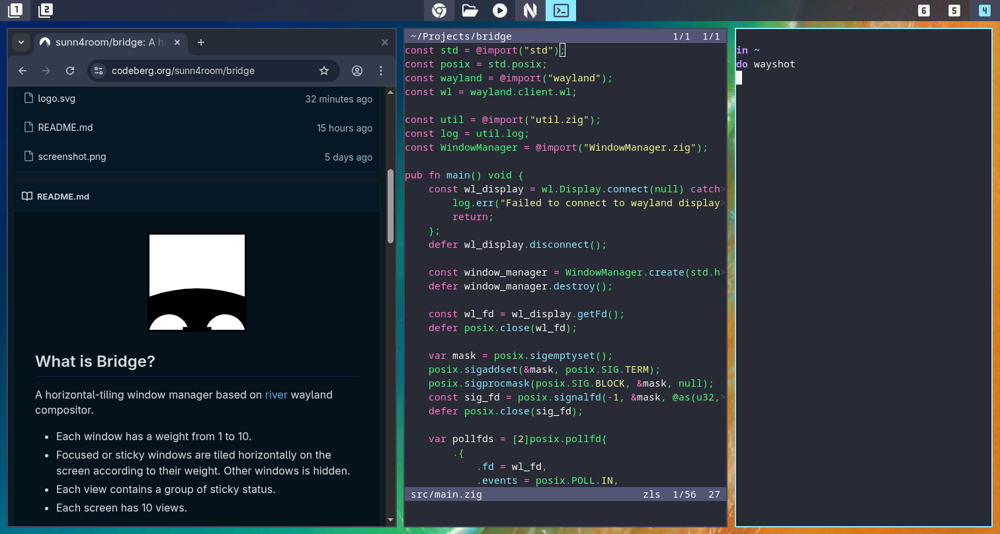

<div align="center">
  
</div>

## What is Bridge?

A horizontal-tiling window manager based on [river](https://codeberg.org/river/river/) wayland compositor. Under a bridge, there are bridge openings of different sizes arranged horizontally. This window manager also has windows of different widths tiled horizontally.

- Each window has a weight from 1 to 10.
- Focused or sticky windows are tiled horizontally on the screen according to their weight. Other windows is hidden.
- Each view contains a group of sticky status.
- Each screen has 10 views.



## Why Bridge?

- Bridge is Lightweight. Bridge has 2500+ lines of zig source code.
- Bridge is Minimalist. This project is written for people who like a minimalist style.
- Bridge is Attention-friendly. You should focus on which windows should be displayed, rather than where the windows should be placed.
- Bridge has Built-in status bar. The bar is used to show the informations about views, windows and weights.

## Why not Bridge?

- Bridge is not interested in advanced features, such as animations.
- Bridge becomes very ugly when tiling 3+ windows.
- Bridge is not good at managing 10+ windows.
- Bridge built-in bar only displays icons, not other information such as the time and date.

## How to use Bridge?

### Dependencies

- wayland
- xkbcommon
- fcft
- pixman
- zig (build)

### Build

```sh
zig build -Doptimize=ReleaseSafe --prefix ~/.local install
```

### Run

```sh
river -c bridge
```

> Recommended tools
> - fuzzel
> - foot
> - mako
> - swaybg
> - swaylock
> - wl-clip-persist

## How to config Bridge?

Copy `src/bridge.zon` to `$XDG_CONFIG_HOME/river/bridge.zon` or `$HOME/.config/river/bridge.zon`, and customize it.

- if `$XDG_CONFIG_HOME/river` is exists, bridge will automatically reload `bridge.zon` when it is modified.
- bridge support `reload_config` action. The default keymap is `mod4+r`.
